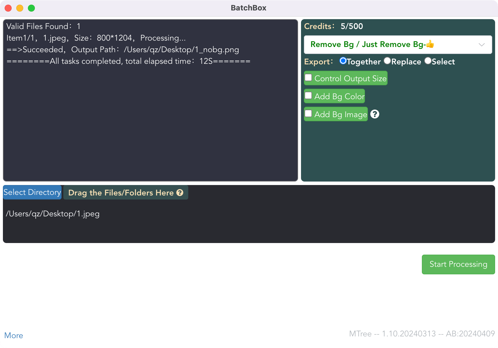
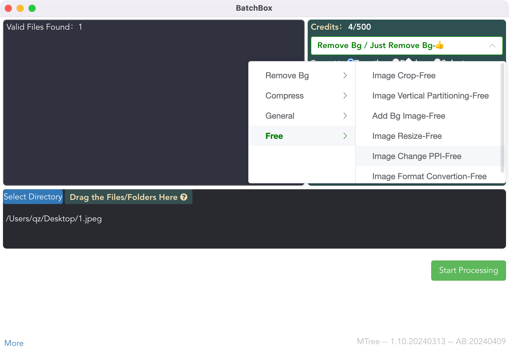
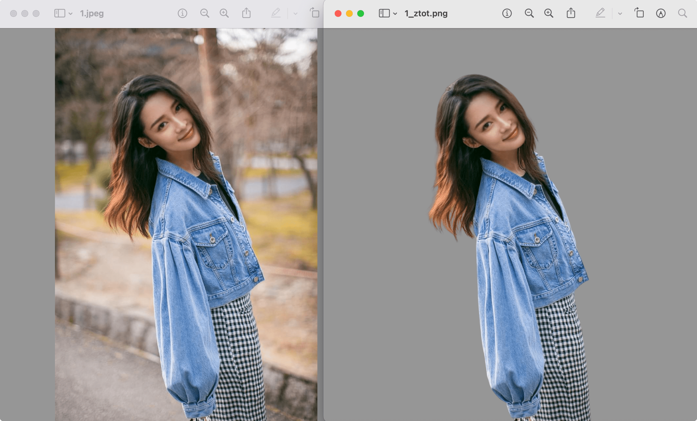

### BatchBox
- A convenient batch processing tool that includes removebg and some other useful tools, supporting both Windows and MacOS systems.

### Tools Included
- Remove Bg
- TinyPNG
- AI Image Enlarge
- More...

<!-- ### Instructions
- Including removebg, high-quality Removebg, HD Removebg & Other Tools, you can freely choose when using -->

### Download Link
- Release Page
[https://github.com/Jasonmin/BatchBox/releases](https://github.com/Jasonmin/BatchBox/releases)

### Instruction

If you’re unable to open it on a Mac, follow these steps: Go to System Preferences -> Security & Privacy -> General -> Open

<!-- [https://github.com/Jasonmin/BatchBox/releases/tag/v1.33.0](https://github.com/Jasonmin/BatchBox/releases/tag/v1.33.0)
  - MacOS     
[https://github.com/Jasonmin/BatchBox/releases/download/v1.33.0/BatchBox-Mac-1.33.0.dmg](https://github.com/Jasonmin/BatchBox/releases/download/v1.33.0/BatchBox-Mac-1.33.0.dmg)
  - Windows   
[https://github.com/Jasonmin/BatchBox/releases/download/v1.33.0/BatchBox-Win-1.33.0.exe](https://github.com/Jasonmin/BatchBox/releases/download/v1.33.0/BatchBox-Win-1.33.0.exe) -->

### Free Trial Activation Code, Credits Available: 4
- fry45e2Dcz5i4Inic4HuDBv0p0c647ypxh4j0iM3jpMexLAXCCOBoOSV581b68dc

### Demo video
<!-- mp4 -->
<video id="video" controls="" preload="none" poster="" width="600px">
      <source id="mp4" src="../../assets/play1080.mp4" type="video/mp4">
</video>

### Product interface

### Price

| Credits | US $ | Notice             |
| ------- | ---- | ------------------ |
| 20      | $1    | use before you buy |
| 100     | $3    |                    |
| 500     | $11   |                    |

### Contact Me
- Email：stephenmtree@gmail.com
- X: @stmtree
